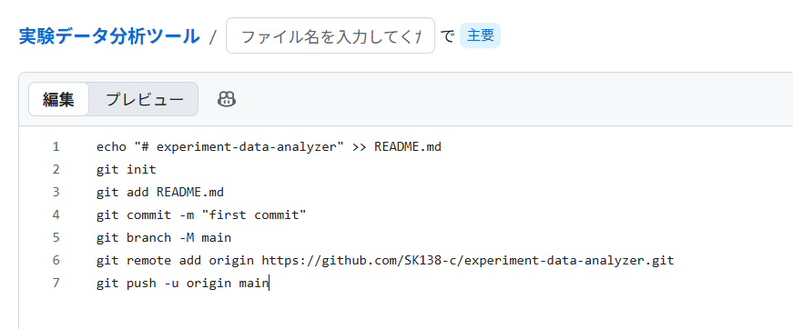

# experiment-data-analyzer

A Python tool for analyzing and visualizing experimental measurement data.

## Features

- Load CSV measurement data
- Calculate basic statistics
- Visualize frequency response
- Display graphs using matplotlib

## Technologies

- Python
- pandas
- matplotlib

## Usage

```bash
python analyzer.py
```

## Sample Data

The repository includes sample frequency response data for testing.

## Result


